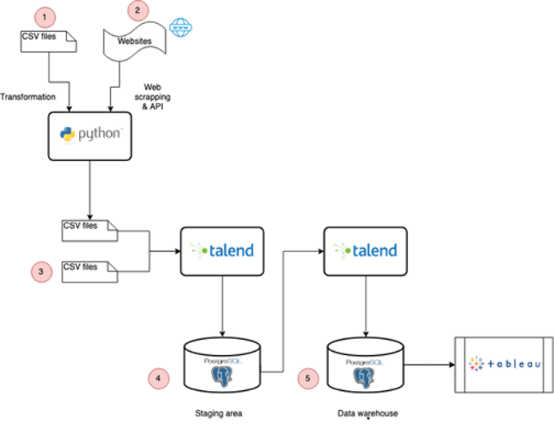
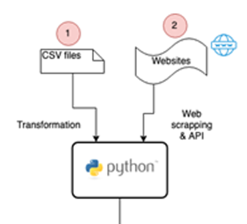
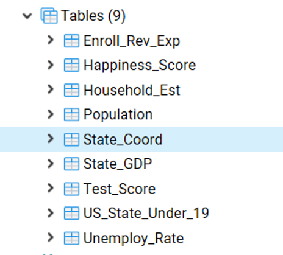
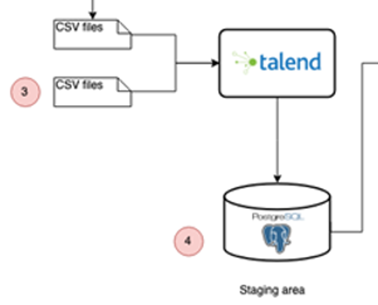
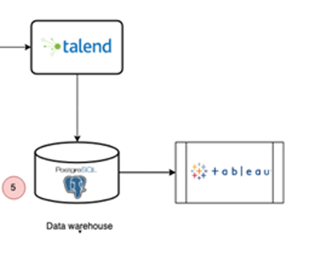
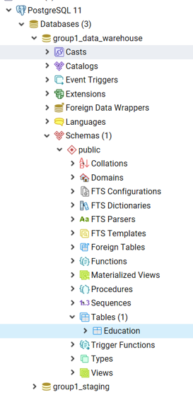
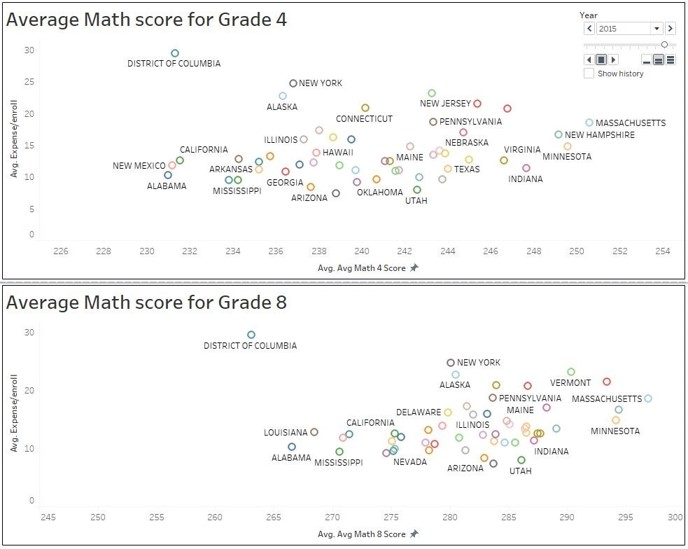
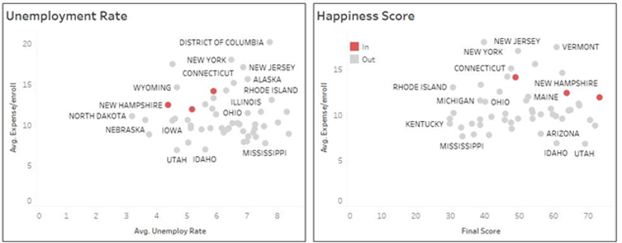
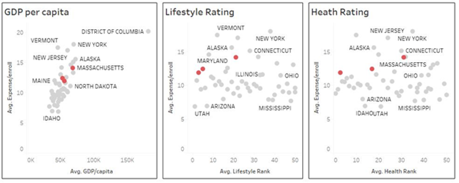

# python_scripts_analysis

In this repository is a collection of Python that I have created for a number of differenet personal and academic projects.

# ETL for Education 
Main focus of this project was create a business problem and create a ETL solution to gather data and prepare it for a data warehouse to make it readily availble for decision making. The vizualication and analysis is not the focus of this project.

# Background
Education plays an important role in society. Being more well educated has a number of benefits including financial, career, personal and societal.
Financial benefits can be found from balance sheets, income statements and adhere to governmental regulation which are published on a timely basis. Financial benefits are easier to quantify and compare, but it does not discount the value of the others. 
Where do we find the others?

How do we choose one benifit over another?

Difficult to directly quantify and make comparisons between non-financial benefits of education. Individuals with post-secondary education: 
- Less likely to smoke
- Lower rates of obesity
- Lower crime rates 
- More likely to report high life satisfaction.  

Would you rather live in a community with lower crime rates or lower levels of life satisfaction?

When do you need to see the benefits?

- Once you have the benefit, creating a time horizon in an investments gives you the ROI (Return on Investment).   
- Investing in a after-school program will yield benefits next year? 4 years?
- Balancing all four benefits do not trouble every financial manager, but do need to be taken into consideration as a public servant. 

# A certain president called for a budget cut…..

There is no public servant with more responsibility than the president of the United States.
Running a country includes looking after the military, the economy, creating laws and healthcare and education.
In the planned 2018 fiscal budget, Donald Trump called for $9.2 billion or %13.5 cut to education. 
This proposed cut will have affect many different programs and each cut will have their own affect. 

Need to take all 4 benefits into account!

Insight Corp. (aka Yours Truely) has been hired as a consultant to explore spending habits and test scores of each US state. 
To ensure American citizens still will receive a proper education! By better understanding which state has the more efficient 
educational model, we can help other states during the time of budget cuts. 

# To complete our analysis we need data!

Data sets from all over the internet
By utilizing a range of open source tools, we are able to automate the Extract Transform and Load process and get properly 
formatted data ready for analysis in the data warehouse. 

Teck Stack: Combination of Python, Talend, Postgres and Tableau.

A total of 23 datasets! We were able to gather variables of interest from a number of different formats. From CSV, Excel, Json, Html and both structured and semi-structured. Each were transformed into a suitable format before being loaded into the data warehouse. 

Variables of interest: 

Gross Domestic Product, Population, Test scores, Number of households, Number of children below 19, Unemployment rate for each state, Happiness rank, Health rank, Lifestyle rank, State Coordinates, Number of enrollments, State revenue on education, and State expenditure on education 

# How we gathered the data
- Downloaded Csv and Excel files

We used Python to….
- Interact with an API to gather data on latitude and longitude. Reading state names from a Csv file, the pining an API and writing the coordinates into another Csv.
- Create a webscraper to parse html to gather variables of interest
- Data cleaning tasks.

# Feeding our ETL

In total we have 23 sets and we are combining them into a 1 dimensional table.

1 - Using Python to transform and merge 19 datasets in 5

2 - Gathering more data from API and Web scrapping for 2 more datasets n/

3 - 2 more CSV files 

4 - Staging area has 9 tables from 9 datasets.

5 - 9 datasets in the staging area are combined into 1 dimensional table as the datawarehouse.

Looking at the first section: 

1.) Downloading the following necessary files: 
- Python Zip file: The directory does not matter as long as you can run Jupyter notebooks. 
- Group 1 – Data Lake: This is where our data has been collected from all over the web. 

2.) Create “Group 1 - CSV for Staging” in the C:\

3.) Open each of the python files:
  - 3-4-7-GDP-Population-Unemployment.ipynb
  - 5-US_State_Under_19_filter.ipynb
  - 6-Households EST.ipynb
  - 8-Happiness rank - Web crawler.ipynb
  - 9-State Coordinate Crawler.ipynb
  
4.) Starting from the top of the list, Run each of the files in order starting with 3-4-7-GDP-Population-Unemployment.ipynb

5.) After running each of the files, check Group 1 - CSV for Staging” in the C:\ to see the cleaned data files that are ready to be read into Talend.

Combining with other data files in order to 

  

Talend

 

Postgres

  

Intial vizualizing with Tableau

A couple of the states are a lot bigger than others! To standardize comparison, we calculated:

(Expenditure)/(# of students enrolled) = spending per student

Lets try to identify the top 3!

How the top states compare

Located on the right meaning high marks and middle of the pack in terms of spending per student enrolled.
- Minnesota
- New Hampshire
- Massachusetts

Let how these states rank on other variables of interest that are not test score. 

Unemployment Rate: Lower than average.
Happiness Score: Higher than average.

 

You want to live in a state with a low ranking (1 being best)
GDP: Slightly higher than average on GDP/Capita.
Lifestyle Rating (1 being best) top 3 are rated well.
Health Rating (1 being best) top 3 are sporadic.

Overall thoughts
- 4/5 variables the top three states do score higher
- Promising results but future analysis can be taken
- We thought 23 data sets was a good amount to start with.
- Insight Corp. was able to deliver the ETL solution on time to Congress.
- They will be using out tool to automate their data aggregation. 

Future Analysis
Overall, we tried to bring as many data points that might relevant to answer the business question. However, additional data we would like to find if we had more time and data available on the internet:

- Average information about score break down by ethnicity 
- Average GDP 
- Average population 
- Average number of schools 
- Average number of households and number of children under 18 
- Household income 
- Average number of years of education 
- Average expenditure of household on different aspects, including education 
- Average quality of life

